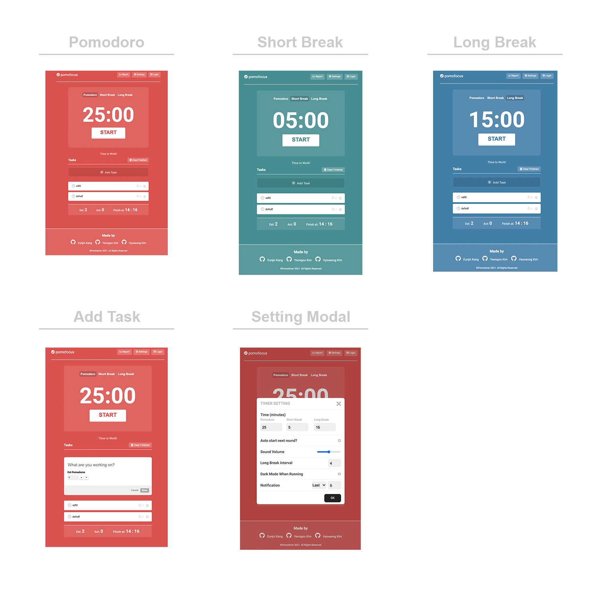

## Team

|강은진|김연구|김효성|
|---|---|---|
|[ejinaaa](https://github.com/ejinaaa)|[yg-0103](https://github.com/yg-0103)|[hyorard-b](https://github.com/hyorard-b)|


## Preview



## Technology Stack


## Architecture


## Introduction

[Focus To-do 뽀모도로 기법 사이트](https://pomofocus.io/) 클론 코딩 소스 코드 저장소입니다.

>뽀모도로 기법이란 25분 동안 한가지 일에 전적으로 집중하고 5분 휴식하여 집중시간에는 인터넷 뉴스를 보거나 소셜 미디어에 한 눈 팔지 않고 오직 일에만 집중하는 기법이다.

구현한 기능은 다음과 같습니다.

1. Task List

  - Task 추가 및 삭제
  - 집중 Task 설정
  - Task 체크
  - Task 별 횟수 설정
  - 총 Task 종료 시간 표시

2. 타이머

  - 스탑 워치
  - 화면 전환
  - 시간 설정
  - 자동 시작 설정
  - 인터벌 설정

## Todo Object

```json

{
    "_id": "60093f5a1b9f17653cd61611",
    "auto_start": false,
    "dark_mode": false,
    "long_break": "15",
    "long_interval": "4",
    "noti_freq": "Last",
    "noti_time": "5",
    "pomo_time": "1",
    "short_break": "5",
    "volume": "50",
    "tasks": [
      {
        "id": 1,
        "content": "Hello World",
        "allEst": 1,
        "leftEst": 0,
        "completed": false,
        "active": false
      },
      {
        "id": 2,
        "content": "Bye World",
        "allEst": 1,
        "leftEst": 0,
        "completed": false,
        "active": false
      }
    ]
  }

```